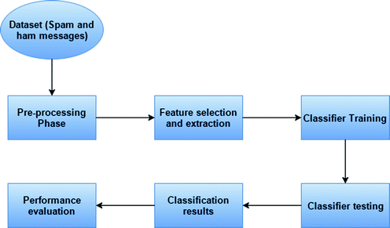

# Spam Detection Model

## 📌 Overview:

This project focuses on Natural Language Processing (NLP) using SMS data to classify messages as either spam or ham (non-spam). It employs various machine learning algorithms, including multinomial-naive-bayes, logistic regression, support vector machines, and decision trees. Additionally, the project utilizes data preprocessing techniques such as PorterStemmer, CountVectorizer, TFIDF Vectorizer, and WordnetLemmatizer. The implementation includes Long Short-Term Memory (LSTM) and Word Embeddings, achieving an impressive accuracy rate of 97.84%.

## ✔❌ Accuracy ❌✔:
| Text Preprocessing Type              | Logistic Regression | Multinomial NB | Support Vector Machine  | Decision Tree |
|--------------------------------------|---------------------|----------------|-------------------------|---------------|
| TFIDF Vectorizer + PorterStemmer     | 96.68%              | 97.30%         | 98.47%                  | 96.68%        |
| CountVectorizer + PorterStemmer      | 98.65%              | 98.56%         | 98.74%                  | 97.84%        |
| CountVectorizer + WordnetLemmatizer  | 98.56%              | 98.29%         | 98.38%                  | 97.75%        |
| TFIDF Vectorizer + WordnetLemmatizer | 96.41%              | 97.48%         | 98.47%                  | 96.86%        |

## Workflow:

## 🏁 Dataset Used:
* The dataset employed in this project is the SMS Spam Dataset, provided by UCI Machine Learning. This dataset can be downloaded from [here](https://www.kaggle.com/uciml/sms-spam-collection-dataset/download).
* More information about this dataset is available [here](http://www.dt.fee.unicamp.br/~tiago/smsspamcollection/).

## 📧 Contact:
For any suggestions or assistance with the model's code, please contact me at jawwadumar99@gmail.com.